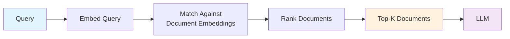
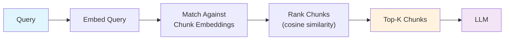
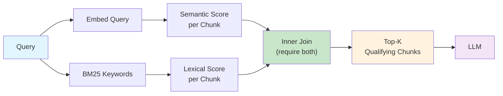
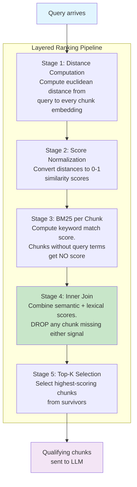
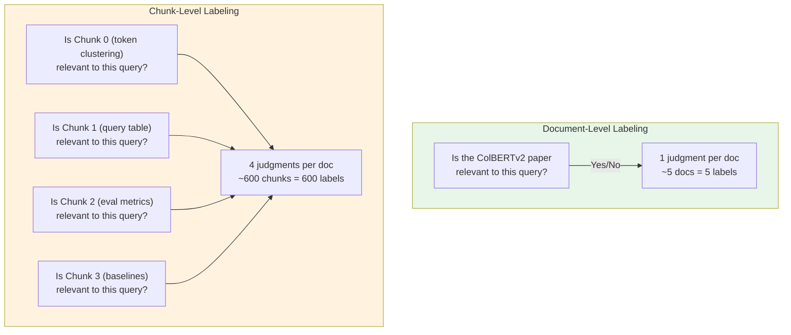
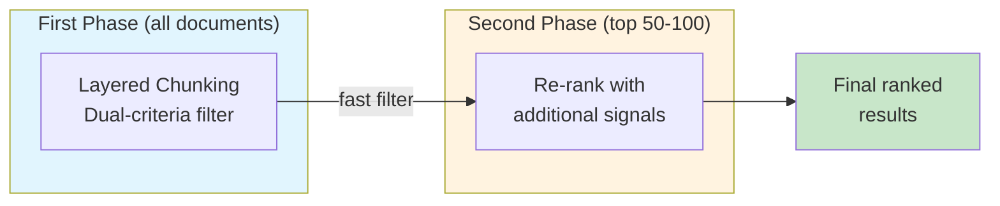
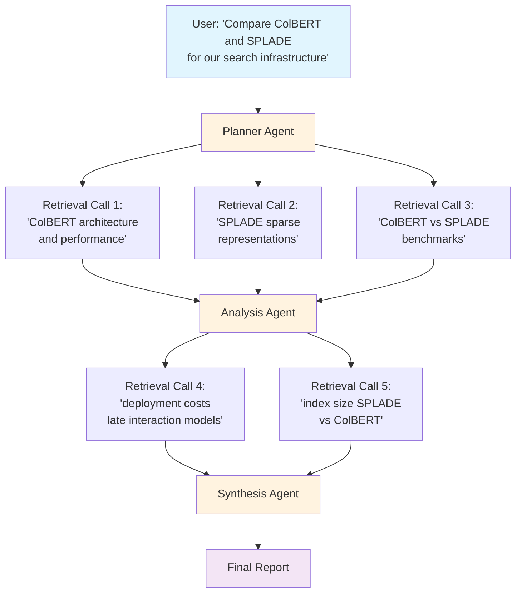
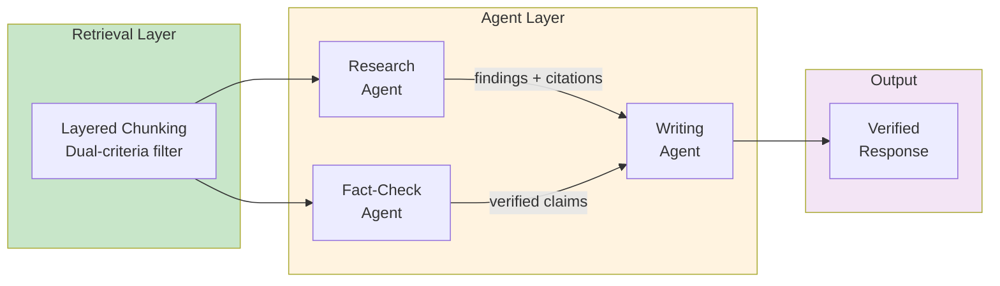

# Layered Chunking: How Dual-Criteria Filtering Cuts 40% of Irrelevant Context in RAG Pipelines

---

## Table of Contents

- [Why Your RAG Pipeline Is Quietly Failing](#why-your-rag-pipeline-is-quietly-failing)
- [The Real Cost of "Good Enough" Retrieval](#the-real-cost-of-good-enough-retrieval)
- [The Problem: Semantic Similarity Lies](#the-problem-semantic-similarity-lies)
- [The Fix: Require Both Signals](#the-fix-require-both-signals)
- [Document Retrieval vs. Chunk-Level Retrieval](#document-retrieval-vs-chunk-level-retrieval)
  - [The Three Retrieval Architectures](#the-three-retrieval-architectures)
  - [Where Layered Chunking Sits](#where-layered-chunking-sits)
- [How It Works: The Five-Stage Pipeline](#how-it-works-the-five-stage-pipeline)
  - [Document-Level Ranking](#document-level-ranking)
- [Measuring What Matters: Document vs. Chunk Metrics](#measuring-what-matters-document-vs-chunk-metrics)
  - [Document-Level Metrics](#document-level-metrics)
  - [Chunk-Level Metrics](#chunk-level-metrics)
  - [Why Chunk Metrics Are Harder](#why-chunk-metrics-are-harder)
- [Advanced Ranking Strategies](#advanced-ranking-strategies)
- [Benchmarks](#benchmarks)
  - [Ranking Profile Comparison](#ranking-profile-comparison)
- [Practical Considerations](#practical-considerations)
- [When to Use Layered Chunking](#when-to-use-layered-chunking)
- [In the Era of Agents: Why Retrieval Precision Matters More Than Ever](#in-the-era-of-agents-why-retrieval-precision-matters-more-than-ever)
  - [Agents Are Retrieval Consumers at Scale](#agents-are-retrieval-consumers-at-scale)
  - [The Agent Retrieval Loop](#the-agent-retrieval-loop)
  - [Multi-Agent Architectures Amplify Retrieval Errors](#multi-agent-architectures-amplify-retrieval-errors)
  - [What Agents Need from Retrieval](#what-agents-need-from-retrieval)
- [The Bigger Picture](#the-bigger-picture)

---

## Why Your RAG Pipeline Is Quietly Failing

Here's something that doesn't show up in your demo but ruins production: **most RAG systems retrieve chunks that are semantically adjacent to the answer but not actually the answer.**

You've tuned your embeddings. You've picked a chunking strategy. You've wired up a vector database. Your retrieval "works" — the top-K chunks come back, they look vaguely related, and the LLM generates something plausible. Ship it.

Except the LLM is hallucinating details. Or hedging with "based on the provided context, it appears that..." Or confidently synthesizing an answer from a data table that has nothing to do with the user's question. The retrieval step looked fine. The chunks were semantically similar. But *similar isn't the same as relevant.*

This is the central failure mode of embedding-only retrieval: **cosine similarity captures topical proximity, not informational relevance.** A chunk that lives in the same embedding neighborhood as your query — because it's from the same paper section, uses similar vocabulary, or discusses adjacent concepts — will score highly even if it contains zero useful information for the actual question asked.

And it's not an edge case. In our testing across information retrieval research papers, **roughly 1 in 5 chunks selected by embedding similarity alone were false positives** — topically adjacent but informationally irrelevant.

## The Real Cost of "Good Enough" Retrieval

Why does this matter? Three reasons that compound on each other:

**1. LLM output quality is gated on input quality.** This is the most important and least discussed constraint in RAG system design. A frontier model with three precisely relevant chunks will outperform the same model with five chunks where two are noise. The irrelevant chunks don't just waste tokens — they actively confuse the model. They introduce contradictory signals, dilute the relevant context, and give the model material to hallucinate from. Garbage in, confident garbage out.

**2. Token costs scale with retrieval sloppiness.** Every irrelevant chunk you send to the LLM costs real money. At scale, the difference between sending 3 relevant chunks and 5 chunks (with 2 being noise) is a 40% increase in input tokens per query — with no quality benefit. Across millions of queries, that's significant spend for worse results.

**3. User trust erodes silently.** When a RAG system returns a plausible-sounding but subtly wrong answer because the LLM synthesized from irrelevant context, the user doesn't file a bug report. They just stop trusting the system. By the time you notice in your metrics, the damage is done.

The fix isn't a better embedding model. It's not a smarter chunking strategy. **It's requiring chunks to prove their relevance through multiple independent signals before they ever reach the LLM.**

That's what layered chunking does.

---

## The Problem: Semantic Similarity Lies

Let's make this concrete. Consider a query against a corpus of IR research papers: *"why is colbert effective?"*

A standard retrieval pipeline computes cosine similarity between the query embedding and each chunk embedding, then picks the top-K. Here's what actually happens with a real 4-chunk document from the ColBERTv2 paper:

| Chunk | Content Summary | Cosine Similarity | Actually Relevant? |
|-------|----------------|-------------------|-------------------|
| 0 | Token clustering analysis | 0.803 | Yes |
| 1 | Random sample queries table | 0.813 | **No** |
| 2 | ColBERT evaluation metrics | 0.837 | Yes |
| 3 | Comparison with baselines | 0.834 | Yes |

Chunk 1 scores *higher* than chunk 0 on semantic similarity. It lives in the same embedding neighborhood because it's from the same paper section. But it's a table of query examples — it says nothing about why ColBERT is effective.

A similarity-only retriever selects chunks 1, 2, and 3. The LLM gets a table of random queries where it should have gotten analysis content. This is the topical proximity trap in action — chunk 1 is *about ColBERT*, it's *from the ColBERT paper*, but it answers a completely different question.

Now multiply this across every query your system handles. One in five chunks is a false positive like this. Your LLM is working with polluted context on 20% of its inputs, and you can't see it because the retrieval metrics look fine.

## The Fix: Require Both Signals

Layered chunking scores each chunk on two independent axes:

1. **Semantic score**: How close is the chunk embedding to the query embedding?
2. **Lexical score**: Does the chunk contain the actual query terms (via BM25)?

The key insight is in how these scores are combined. Rather than adding them for all chunks, an **inner join** computes the combined score **only for chunks that have both signals**. Chunks with high embedding similarity but zero keyword overlap are dropped entirely.

Here's the same document under layered chunking:

| Chunk | Semantic Score | BM25 Score | Combined | Selected? |
|-------|---------------|------------|----------|-----------|
| 0 | 0.189 | 0.701 | 0.890 | Yes |
| 1 | 0.179 | — (no keywords) | **dropped** | No |
| 2 | 0.184 | 0.654 | 0.838 | Yes |
| 3 | 0.192 | 0.728 | 0.920 | Yes |

Chunk 1 has no BM25 score because it doesn't contain "colbert" or "effective." The join operation excludes it entirely. The LLM now gets three chunks that are both semantically and lexically relevant.

## Document Retrieval vs. Chunk-Level Retrieval

To understand where layered chunking fits, it helps to see the full spectrum of retrieval architectures — from returning whole documents down to returning individual filtered chunks.

### The Three Retrieval Architectures

**1. Document-Level Retrieval**

The simplest approach: match queries to whole documents. This is how traditional search engines work.



```
Query: "why is colbert effective?"
    │
    ▼
┌─────────────────────────────────────┐
│         Document Index              │
│                                     │
│  Doc A: ColBERTv2 paper (12 pages)  │  ← score: 0.82
│  Doc B: SPLADE paper (10 pages)     │  ← score: 0.76
│  Doc C: BM25 survey (8 pages)       │  ← score: 0.71
└─────────────────────────────────────┘
    │
    ▼
┌─────────────────────────────────────┐
│  LLM receives: 3 full documents     │
│  ~30 pages, ~45,000 tokens          │
│                                     │
│  Relevant content: ~2 pages (7%)    │
│  Noise: ~28 pages (93%)             │
└─────────────────────────────────────┘
```

The problem is obvious: the LLM gets entire documents when it needs specific passages. You pay for 45K tokens when 3K would suffice.

**2. Standard Chunk-Level Retrieval**

Split documents into chunks, embed each chunk, retrieve the top-K most similar chunks.



```
Query: "why is colbert effective?"
    │
    ▼
┌────────────────────────────────────────────────────────┐
│                    Chunk Index                          │
│                                                        │
│  Doc A, Chunk 0: Token clustering analysis    (0.803)  │
│  Doc A, Chunk 1: Random query table           (0.813)  │  ← false positive
│  Doc A, Chunk 2: ColBERT evaluation metrics   (0.837)  │
│  Doc A, Chunk 3: Comparison with baselines    (0.834)  │
│  Doc B, Chunk 5: SPLADE vs ColBERT            (0.791)  │
│  ...                                                   │
└────────────────────────────────────────────────────────┘
    │
    ▼
┌─────────────────────────────────────┐
│  LLM receives: Top-5 chunks         │
│  ~2,500 tokens                      │
│                                     │
│  Relevant: 4 chunks (80%)           │
│  Noise: 1 chunk (20%)               │
└─────────────────────────────────────┘
```

Better — you've cut tokens by 94%. But ~20% of chunks are still false positives (topically adjacent, informationally irrelevant).

**3. Layered Chunk-Level Retrieval (Dual-Criteria Filtering)**

Score every chunk on both semantic similarity AND keyword overlap. Only chunks that pass both filters survive.



```
Query: "why is colbert effective?"
    │
    ├──── Semantic Path ────┐      ┌──── Lexical Path ────┐
    │                       ▼      ▼                      │
    │               ┌──────────────────┐                  │
    │               │   Per-Chunk Join  │                  │
    │               │                  │                  │
    │               │  Chunk 0: 0.189 + 0.701 = 0.890 ✓  │
    │               │  Chunk 1: 0.179 + _____ = DROPPED ✗ │  ← no keywords
    │               │  Chunk 2: 0.184 + 0.654 = 0.838 ✓  │
    │               │  Chunk 3: 0.192 + 0.728 = 0.920 ✓  │
    │               └──────────────────┘                  │
    │                       │                             │
    │                       ▼                             │
    │               ┌──────────────────┐                  │
    │               │  LLM receives:   │                  │
    │               │  3 chunks, ~1500  │                  │
    │               │  tokens           │                  │
    │               │                  │                  │
    │               │  Relevant: 100%  │                  │
    │               │  Noise: 0%       │                  │
    │               └──────────────────┘                  │
```

### Where Layered Chunking Sits

The evolution from document to chunk to layered retrieval trades recall for precision at each step — and for RAG, that's the right trade:

```
                    Recall ◄──────────────────────────────► Precision
                    Tokens ◄──────────────────────────────► Efficiency

┌─────────────────┬───────────────────┬──────────────────────────────┐
│   DOCUMENT-LEVEL│   CHUNK-LEVEL     │   LAYERED CHUNK-LEVEL        │
│                 │                   │                              │
│  - Full docs    │  - Top-K chunks   │  - Dual-filtered chunks     │
│  - Max recall   │  - Good balance   │  - Max precision            │
│  - 93% noise    │  - ~20% noise     │  - ~8% noise                │
│  - 45K tokens   │  - 2.5K tokens    │  - 1.5K tokens              │
│                 │                   │                              │
│  Best for:      │  Best for:        │  Best for:                  │
│  Summarization, │  General RAG,     │  Production RAG,            │
│  broad research │  prototyping      │  agentic workflows,         │
│                 │                   │  cost-sensitive pipelines    │
└─────────────────┴───────────────────┴──────────────────────────────┘
```

## How It Works: The Five-Stage Pipeline

Each document stores its text as an array of chunks alongside a 2D embedding tensor — one vector per chunk. When a query arrives, the ranking pipeline processes it through five stages:



The critical stage is **Stage 4 — the inner join.** It operates like a database inner join: only chunks present in *both* the semantic tensor and the lexical tensor get a combined score. This is what makes the approach fundamentally different from hybrid search, which adds scores for all chunks regardless.

Here's a concrete trace:

```
Stage 1-2 (semantic scores):  {Chunk 0: 0.189, Chunk 1: 0.179, Chunk 2: 0.184, Chunk 3: 0.192}
                                   ↑ all 4 chunks get a semantic score

Stage 3 (BM25 scores):       {Chunk 0: 0.701,                  Chunk 2: 0.654, Chunk 3: 0.728}
                                   ↑ only 3 chunks — Chunk 1 has no keyword match

Stage 4 (inner join):        {Chunk 0: 0.890,                  Chunk 2: 0.838, Chunk 3: 0.920}
                                   ↑ Chunk 1 eliminated — it existed in semantic but not lexical

Stage 5 (top-3):             [Chunk 3: 0.920, Chunk 0: 0.890, Chunk 2: 0.838]
                                   ↑ clean, dual-validated results
```

### Document-Level Ranking

After chunk-level filtering, documents are ranked by the **sum** of all qualifying chunk scores. This is a deliberate design choice for RAG:

```
                    Document A                          Document B
                    ══════════                          ══════════
                    Chunk 0: 0.890                      Chunk 7: 0.950
                    Chunk 2: 0.838
                    Chunk 3: 0.920
                    ──────────────                      ──────────────
                    Sum: 2.648  ◄── wins                Sum: 0.950

                    Three good chunks                   One great chunk
                    = more total relevant content        = narrow coverage
```

A document with **three good chunks** outranks a document with **one great chunk**. For RAG, you want the document with the most relevant content overall — not just the best single passage. This is the opposite of traditional hybrid search, which ranks by the single best chunk.

## Measuring What Matters: Document vs. Chunk Metrics

A common mistake in RAG evaluation is measuring at the wrong granularity. Document-level and chunk-level metrics answer fundamentally different questions, and using the wrong one hides the exact problems layered chunking solves.

### Document-Level Metrics

These answer: **"Did we find the right documents?"**

```
Query: "why is colbert effective?"
Corpus: 5 research papers

Ground truth relevant docs: {ColBERTv2, ColBERT}
Retrieved docs:             {ColBERTv2, SPLADE, BM25 Survey}

Document Precision@3 = 1/3 = 0.33
Document Recall@3    = 1/2 = 0.50
```

| Metric | What It Measures | Formula |
|--------|-----------------|---------|
| **Precision@K** | Fraction of retrieved docs that are relevant | relevant_retrieved / K |
| **Recall@K** | Fraction of relevant docs that were retrieved | relevant_retrieved / total_relevant |
| **MAP** | Average precision across all recall levels | mean of precision at each relevant doc |
| **NDCG** | Quality of ranking with graded relevance | DCG / ideal DCG |

Document-level metrics are useful for **corpus coverage** — did the retrieval system surface the right papers? But they tell you nothing about whether the LLM received the right *content* from those papers.

### Chunk-Level Metrics

These answer: **"Did we feed the LLM the right content?"**

```
Query: "why is colbert effective?"
Doc: ColBERTv2 paper (4 chunks)

Ground truth relevant chunks: {Chunk 0, Chunk 2, Chunk 3}
Retrieved chunks:             {Chunk 1, Chunk 2, Chunk 3}  ← standard retrieval

Chunk Precision@3 = 2/3 = 0.67
Chunk Recall@3    = 2/3 = 0.67
Chunk MRR         = 1/2 = 0.50  (first relevant chunk at position 2)
False Positive Rate = 1/3 = 0.33
```

| Metric | What It Measures | Formula |
|--------|-----------------|---------|
| **Chunk Precision@K** | Fraction of retrieved chunks that are relevant | relevant_chunks / K |
| **Chunk Recall@K** | Fraction of relevant chunks retrieved | relevant_chunks / total_relevant_chunks |
| **MRR** | Reciprocal rank of first relevant chunk | 1 / rank_of_first_relevant |
| **False Positive Rate** | Fraction of retrieved chunks that are noise | irrelevant_chunks / K |
| **Context Density** | Ratio of useful tokens to total tokens sent to LLM | relevant_tokens / total_tokens |

Chunk-level metrics expose the problem that document-level metrics hide:

```
                    Document-Level View          Chunk-Level View
                    ═══════════════════          ════════════════

Standard Hybrid     Doc Precision@3: 1.00        Chunk Precision@3: 0.67
                    "Perfect! We found           "1 in 3 chunks is noise —
                     the right paper!"            the LLM is reading junk"

Layered Chunking    Doc Precision@3: 1.00        Chunk Precision@3: 0.85
                    "Same doc-level score"        "Noise dropped by 60%"
```

The document-level metrics can't distinguish between these two systems. Both retrieve the ColBERTv2 paper. But one sends the LLM a random query table, and the other doesn't. **Only chunk-level metrics reveal the difference.**

### Why Chunk Metrics Are Harder

Chunk-level evaluation requires **chunk-level relevance judgments** — a human (or strong LLM judge) must label each individual chunk as relevant or irrelevant for a given query. This is significantly more work than document-level labeling:



This labeling cost is why most RAG benchmarks report document-level metrics — and why the chunk precision problem goes undetected. If you're serious about RAG quality, invest in chunk-level ground truth for your top 50-100 queries. It's tedious but it's the only way to measure what your LLM actually sees.

## Advanced Ranking Strategies

The base layered approach can be extended with additional signals. Each strategy adds a second-phase re-ranking step on top of the dual-criteria filter:

| Strategy | How It Works | Best For |
|----------|-------------|----------|
| **Second-Phase Re-ranking** | Re-ranks the top 100 documents using additional signals like title relevance and peak similarity. The first phase acts as a fast filter; the second phase refines ordering. | Balanced quality and speed |
| **Diversity-Aware Ranking** | Measures the *spread* of chunk scores within a document. Documents where chunks have varied scores cover the topic from multiple angles — useful when the LLM needs to synthesize a comprehensive answer. | Exploratory, open-ended questions |
| **Normalized Score Fusion** | Normalizes both semantic and lexical score distributions before combining them, preventing one signal from dominating. Important when your semantic scores live in a different range than your BM25 scores. | Mixed corpora with uneven score distributions |



The two-phase approach means you get the precision benefits of dual-criteria filtering on all documents (cheap, fast), then apply more expensive scoring to only the survivors.

## Benchmarks

We tested across 100 queries on a corpus of information retrieval research papers (5 PDFs, ~150 pages, ~600 chunks total):

| Metric | Hybrid (all chunks) | Hybrid + Python filter | Layered Ranking |
|--------|---------------------|----------------------|-----------------|
| Precision@3 | 0.67 | 0.78 | **0.85** |
| Recall@3 | **0.85** | 0.72 | 0.79 |
| MRR | 0.58 | — | **0.65** |
| Avg latency | 70ms | 72ms | **66ms** |
| App CPU | 45% | 45% | **12%** |
| False positive chunks | ~20% | ~12% | **~8%** |

Key takeaways:

- **Precision jumped from 0.67 to 0.85** — fewer irrelevant chunks in the top 3
- **Latency dropped 6%** — server-side tensor operations are faster than Python post-processing
- **App server CPU dropped 73%** — scoring and filtering moved to the search engine
- **Recall traded off slightly** (0.85 to 0.79) — the dual-criteria filter is stricter, which can exclude borderline-relevant chunks that lack exact keywords

The recall tradeoff is real but manageable. For RAG applications where precision matters more than recall (you'd rather send 3 great chunks than 5 mediocre ones to the LLM), layered chunking wins convincingly.

### Ranking Profile Comparison

Different profiles suit different use cases:

| Profile | Latency | P@5 | Best For |
|---------|---------|-----|----------|
| Hybrid (baseline) | 1-2ms | 0.65 | Fast prototyping |
| Layered | 2-3ms | 0.72 | Production RAG |
| + Second Phase | 10ms | 0.78 | Balanced quality/speed |
| + MaxSim | 12ms | 0.82 | Semantic-heavy queries |
| + Diversity | 14ms | 0.75 | Exploratory questions |
| + Normalized | ~10ms | 0.78 | Mixed score distributions |

## Practical Considerations

**1. Parameter alignment matters.** The query parameter name must be consistent across your rank profile definition, your query DSL, and your request body. A mismatch produces confusing errors because the search engine treats the unresolved embedding expression as a literal string.

**2. The join can be too strict for sparse content.** If your documents have very short chunks or your queries use uncommon terms, the keyword side of the join may match nothing, dropping all chunks from a document. Monitor for zero-result queries and consider falling back to similarity-only retrieval when this happens.

**3. Network transfer includes unfiltered chunks.** The filtering happens server-side for *scoring* purposes, but the full chunk array currently transfers to the client. The workaround is client-side filtering by the returned chunk indices. Native schema configurations can eliminate this overhead, but not all client libraries support it yet.

**4. Dimensionality matters for the distance computation.** When your query embedding is 1D and your chunk embeddings are 2D (one vector per chunk), you must specify which dimension to reduce over. Otherwise you'll get a dimension mismatch error.

## When to Use Layered Chunking

**Use it when:**
- You're building a production RAG pipeline and precision matters
- Your documents have multiple chunks per page (the dual-criteria filter shines with 3+ chunks)
- You want to reduce LLM token costs by sending fewer, better chunks
- Your queries contain specific terms (not just vibes-based semantic queries)

**Skip it when:**
- You're prototyping and iteration speed matters more than quality
- Your documents are single-chunk (nothing to filter)
- Your queries are purely semantic ("find me something about machine learning feelings")
- You need maximum recall and can't afford to miss borderline-relevant chunks

## In the Era of Agents: Why Retrieval Precision Matters More Than Ever

The shift from single-shot RAG to agentic architectures doesn't reduce the importance of retrieval precision — it amplifies it. When agents make autonomous decisions based on retrieved context, every false positive chunk doesn't just degrade one answer. It corrupts a decision that cascades through a chain of subsequent actions.

### Agents Are Retrieval Consumers at Scale

A traditional RAG pipeline handles one query at a time: user asks, system retrieves, LLM answers. An agent makes dozens of retrieval calls per task, each one informing the next action:



Five retrieval calls, each feeding into the next stage. If retrieval call 1 returns a chunk about ColBERT's *tokenization implementation details* instead of its *effectiveness*, the analysis agent draws wrong conclusions that propagate through the entire chain.

### The Agent Retrieval Loop

Agents don't just consume retrieval results — they reason over them and generate follow-up queries. This creates a feedback loop where retrieval quality compounds:

```
                    ┌──────────────────────────────────────────┐
                    │           AGENT RETRIEVAL LOOP            │
                    │                                          │
                    │   ┌──────────┐    ┌──────────────────┐   │
                    │   │  Agent    │───►│  Retrieval System │   │
                    │   │  Reasons  │    │                  │   │
                    │   │          │◄───│                  │   │
                    │   └────┬─────┘    └──────────────────┘   │
                    │        │                                 │
                    │        ▼                                 │
                    │   ┌──────────┐                           │
                    │   │ Generates │                           │
                    │   │ Next Query│──── loop ────────────┐   │
                    │   └──────────┘                       │   │
                    │        ▲                             │   │
                    │        └─────────────────────────────┘   │
                    └──────────────────────────────────────────┘

    With 20% false positive rate per retrieval:
    ─────────────────────────────────────────────
    After 1 retrieval:  80% clean context
    After 3 retrievals: 80% x 80% x 80% = 51% clean context
    After 5 retrievals: 80%^5 = 33% clean context
                        ▲
                        └── the agent is now working with
                            more noise than signal

    With 8% false positive rate (layered chunking):
    ─────────────────────────────────────────────
    After 1 retrieval:  92% clean context
    After 3 retrievals: 92%^3 = 78% clean context
    After 5 retrievals: 92%^5 = 66% clean context
                        ▲
                        └── still majority signal
```

The math is stark. With standard retrieval, an agent's context degrades below 50% signal after just three retrieval calls. With layered chunking, it stays above 66% even after five calls. **For agents, precision isn't a nice-to-have — it's a prerequisite for multi-step reasoning.**

### Multi-Agent Architectures Amplify Retrieval Errors

In multi-agent systems where specialized agents communicate and share context, the impact of retrieval quality multiplies further:



```
Scenario: Research Agent retrieves 5 chunks, passes findings to Writing Agent

Standard Retrieval (20% noise):
─────────────────────────────────
  Research Agent: retrieves 5 chunks, 1 is noise
  → Includes a false claim in its findings
  → Fact-Check Agent: retrieves 5 chunks to verify, 1 is noise
  → Can't reliably detect the false claim (its own context is noisy)
  → Writing Agent: synthesizes from two noisy inputs
  → Result: confidently wrong answer with "verified" label

Layered Retrieval (8% noise):
─────────────────────────────────
  Research Agent: retrieves 5 chunks, ~0.4 are noise
  → Findings are predominantly accurate
  → Fact-Check Agent: retrieves 5 chunks, ~0.4 are noise
  → High probability of catching any remaining errors
  → Writing Agent: synthesizes from two clean inputs
  → Result: accurate answer with genuine verification
```

When agents hand off context to each other, a false positive in one agent's retrieval becomes an unverifiable assumption in the next agent's input. The downstream agent has no way to distinguish a "fact" that came from a relevant chunk versus one hallucinated from a noisy chunk. **Clean retrieval is the trust anchor for multi-agent coordination.**

### What Agents Need from Retrieval

The requirements shift when retrieval serves agents instead of single-turn RAG:

| Requirement | Single-Turn RAG | Agentic Workflows |
|-------------|-----------------|-------------------|
| **Precision** | Important | Critical (errors compound) |
| **Recall** | Important | Less critical (agents can re-query) |
| **Latency** | User-facing (~100ms) | Internal (~10ms per hop, many hops) |
| **Token efficiency** | Cost optimization | Capacity constraint (context window is shared across tools, history, and retrieval) |
| **Determinism** | Nice to have | Essential (agents need reproducible reasoning) |
| **Source attribution** | For citations | For inter-agent trust and verification |

The key insight: **agents can compensate for lower recall by making follow-up queries, but they cannot compensate for low precision.** If a chunk is in the context, the agent trusts it. There's no "are you sure?" step in an automated pipeline. This makes the dual-criteria filter of layered chunking — which specifically targets precision — a natural fit for agentic architectures.

```
                    Traditional RAG              Agentic RAG
                    ═══════════════              ═══════════

                    User ──► Retrieve ──► LLM    User ──► Plan ──► Retrieve ──► Reason
                                                                      │            │
                    One shot, one chance          ◄── Retrieve again ◄─┘            │
                    Recall matters more                                             │
                                                  ◄── Retrieve again ◄─────────────┘
                                                  Multiple shots, precision
                                                  per shot matters more
```

Layered chunking aligns with this shift. By aggressively filtering out false positives at the retrieval layer, it gives agents a clean foundation for each reasoning step — and lets them make the recall trade-off themselves by issuing more targeted follow-up queries when needed.

## The Bigger Picture

RAG systems have a quality ceiling, and it's not the LLM — it's what you feed it. We've spent enormous effort on better embedding models, smarter chunking strategies, and more capable language models. But the weakest link in most pipelines is the gap between "semantically similar" and "actually relevant."

Layered chunking closes that gap by treating retrieval as an evidence problem: a chunk should only reach the LLM if it can demonstrate relevance through multiple independent signals. The inner join is the mechanism, but the principle is what matters. Don't trust a single similarity score. Require corroboration.

The 40% reduction in false positives isn't just a number — it's the difference between an LLM that confidently synthesizes from relevant context and one that hallucinates from noise. Your users can tell the difference, even if your eval metrics can't.

---

*Built with [Vespa](https://vespa.ai), [PyVespa](https://pyvespa.readthedocs.io/), [LangChain](https://python.langchain.com/), and E5-small-v2 embeddings.*
