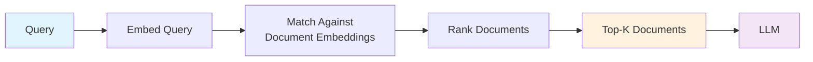
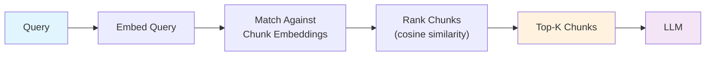
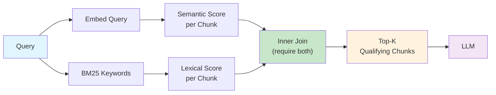
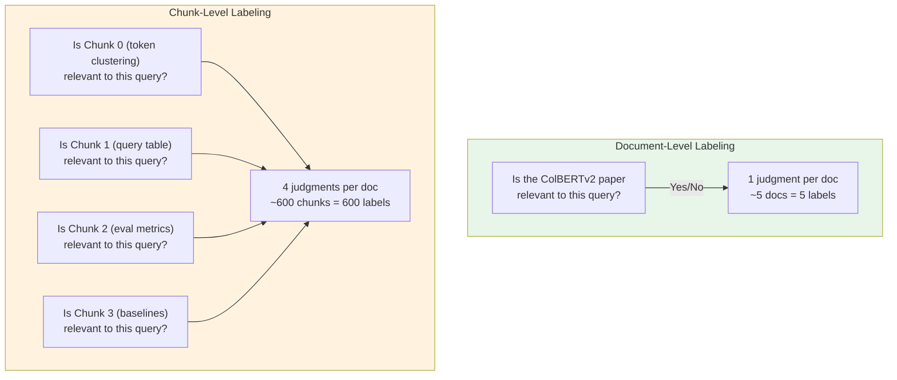
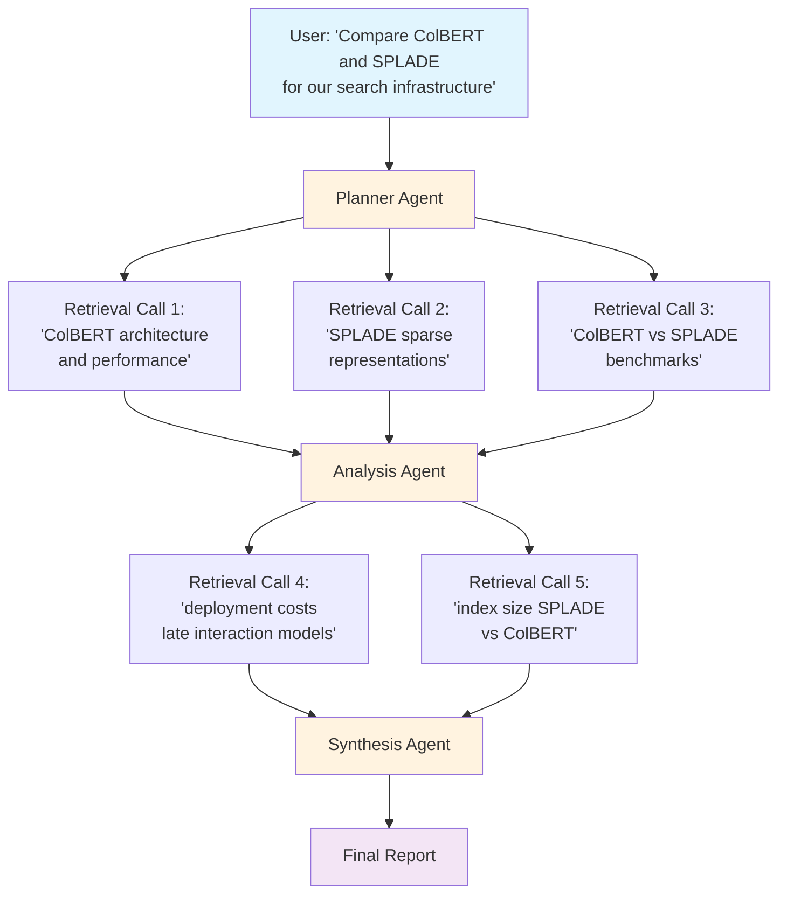
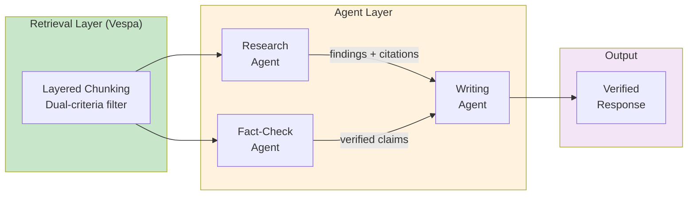

# Layered Chunking: How Dual-Criteria Filtering Cuts 40% of Irrelevant Context in RAG Pipelines

---

## Table of Contents

- [Why Your RAG Pipeline Is Quietly Failing](#why-your-rag-pipeline-is-quietly-failing)
- [The Real Cost of "Good Enough" Retrieval](#the-real-cost-of-good-enough-retrieval)
- [The Problem: Semantic Similarity Lies](#the-problem-semantic-similarity-lies)
- [The Fix: Require Both Signals](#the-fix-require-both-signals)
- [Document Retrieval vs. Chunk-Level Retrieval](#document-retrieval-vs-chunk-level-retrieval)
  - [The Three Retrieval Architectures](#the-three-retrieval-architectures)
  - [Where Layered Chunking Sits](#where-layered-chunking-sits)
- [Architecture: How It Works in Vespa](#architecture-how-it-works-in-vespa)
  - [The Ranking Profile](#the-ranking-profile)
  - [Document-Level Ranking](#document-level-ranking)
- [The Retriever: Connecting to LangChain](#the-retriever-connecting-to-langchain)
- [Measuring What Matters: Document vs. Chunk Metrics](#measuring-what-matters-document-vs-chunk-metrics)
  - [Document-Level Metrics](#document-level-metrics)
  - [Chunk-Level Metrics](#chunk-level-metrics)
  - [Why Chunk Metrics Are Harder](#why-chunk-metrics-are-harder)
- [Advanced Ranking Profiles](#advanced-ranking-profiles)
  - [Second-Phase Re-ranking](#second-phase-re-ranking)
  - [Diversity-Aware Ranking](#diversity-aware-ranking)
  - [Normalized Score Fusion](#normalized-score-fusion)
- [Benchmarks](#benchmarks)
  - [Ranking Profile Comparison](#ranking-profile-comparison)
- [Gotchas and Lessons Learned](#gotchas-and-lessons-learned)
- [When to Use Layered Chunking](#when-to-use-layered-chunking)
- [In the Era of Agents: Why Retrieval Precision Matters More Than Ever](#in-the-era-of-agents-why-retrieval-precision-matters-more-than-ever)
  - [Agents Are Retrieval Consumers at Scale](#agents-are-retrieval-consumers-at-scale)
  - [The Agent Retrieval Loop](#the-agent-retrieval-loop)
  - [Multi-Agent Architectures Amplify Retrieval Errors](#multi-agent-architectures-amplify-retrieval-errors)
  - [What Agents Need from Retrieval](#what-agents-need-from-retrieval)
- [Getting Started](#getting-started)

---

## Why Your RAG Pipeline Is Quietly Failing

Here's something that doesn't show up in your demo but ruins production: **most RAG systems retrieve chunks that are semantically adjacent to the answer but not actually the answer.**

You've tuned your embeddings. You've picked a chunking strategy. You've wired up a vector database. Your retrieval "works" — the top-K chunks come back, they look vaguely related, and the LLM generates something plausible. Ship it.

Except the LLM is hallucinating details. Or hedging with "based on the provided context, it appears that..." Or confidently synthesizing an answer from a data table that has nothing to do with the user's question. The retrieval step looked fine. The chunks were semantically similar. But *similar isn't the same as relevant.*

This is the central failure mode of embedding-only retrieval: **cosine similarity captures topical proximity, not informational relevance.** A chunk that lives in the same embedding neighborhood as your query — because it's from the same paper section, uses similar vocabulary, or discusses adjacent concepts — will score highly even if it contains zero useful information for the actual question asked.

And it's not an edge case. In our testing across information retrieval research papers, **roughly 1 in 5 chunks selected by embedding similarity alone were false positives** — topically adjacent but informationally irrelevant.

## The Real Cost of "Good Enough" Retrieval

Why does this matter? Three reasons that compound on each other:

**1. LLM output quality is gated on input quality.** This is the most important and least discussed constraint in RAG system design. A frontier model with three precisely relevant chunks will outperform the same model with five chunks where two are noise. The irrelevant chunks don't just waste tokens — they actively confuse the model. They introduce contradictory signals, dilute the relevant context, and give the model material to hallucinate from. Garbage in, confident garbage out.

**2. Token costs scale with retrieval sloppiness.** Every irrelevant chunk you send to the LLM costs real money. At scale, the difference between sending 3 relevant chunks and 5 chunks (with 2 being noise) is a 40% increase in input tokens per query — with no quality benefit. Across millions of queries, that's significant spend for worse results.

**3. User trust erodes silently.** When a RAG system returns a plausible-sounding but subtly wrong answer because the LLM synthesized from irrelevant context, the user doesn't file a bug report. They just stop trusting the system. By the time you notice in your metrics, the damage is done.

The fix isn't a better embedding model. It's not a smarter chunking strategy. **It's requiring chunks to prove their relevance through multiple independent signals before they ever reach the LLM.**

That's what layered chunking does.

---

## The Problem: Semantic Similarity Lies

Let's make this concrete. Consider a query against a corpus of IR research papers: *"why is colbert effective?"*

A standard retrieval pipeline computes cosine similarity between the query embedding and each chunk embedding, then picks the top-K. Here's what actually happens with a real 4-chunk document from the ColBERTv2 paper:

| Chunk | Content Summary | Cosine Similarity | Actually Relevant? |
|-------|----------------|-------------------|-------------------|
| 0 | Token clustering analysis | 0.803 | Yes |
| 1 | Random sample queries table | 0.813 | **No** |
| 2 | ColBERT evaluation metrics | 0.837 | Yes |
| 3 | Comparison with baselines | 0.834 | Yes |

Chunk 1 scores *higher* than chunk 0 on semantic similarity. It lives in the same embedding neighborhood because it's from the same paper section. But it's a table of query examples — it says nothing about why ColBERT is effective.

A similarity-only retriever selects chunks 1, 2, and 3. The LLM gets a table of random queries where it should have gotten analysis content. This is the topical proximity trap in action — chunk 1 is *about ColBERT*, it's *from the ColBERT paper*, but it answers a completely different question.

Now multiply this across every query your system handles. One in five chunks is a false positive like this. Your LLM is working with polluted context on 20% of its inputs, and you can't see it because the retrieval metrics look fine.

## The Fix: Require Both Signals

Layered chunking scores each chunk on two independent axes:

1. **Semantic score**: How close is the chunk embedding to the query embedding?
2. **Lexical score**: Does the chunk contain the actual query terms (via BM25)?

The key insight is in how these scores are combined. Rather than adding them for all chunks, a `join` operation computes the combined score **only for chunks that have both signals**. Chunks with high embedding similarity but zero keyword overlap are dropped entirely.

Here's the same document under layered chunking:

| Chunk | Semantic Score | BM25 Score | Combined | Selected? |
|-------|---------------|------------|----------|-----------|
| 0 | 0.189 | 0.701 | 0.890 | Yes |
| 1 | 0.179 | — (no keywords) | **dropped** | No |
| 2 | 0.184 | 0.654 | 0.838 | Yes |
| 3 | 0.192 | 0.728 | 0.920 | Yes |

Chunk 1 has no BM25 score because it doesn't contain "colbert" or "effective." The join operation excludes it from the result tensor entirely. The LLM now gets three chunks that are both semantically and lexically relevant.

## Document Retrieval vs. Chunk-Level Retrieval

To understand where layered chunking fits, it helps to see the full spectrum of retrieval architectures — from returning whole documents down to returning individual filtered chunks.

### The Three Retrieval Architectures

**1. Document-Level Retrieval**

The simplest approach: match queries to whole documents. This is how traditional search engines work.



```
Query: "why is colbert effective?"
    │
    ▼
┌─────────────────────────────────────┐
│         Document Index              │
│                                     │
│  Doc A: ColBERTv2 paper (12 pages)  │  ← score: 0.82
│  Doc B: SPLADE paper (10 pages)     │  ← score: 0.76
│  Doc C: BM25 survey (8 pages)       │  ← score: 0.71
└─────────────────────────────────────┘
    │
    ▼
┌─────────────────────────────────────┐
│  LLM receives: 3 full documents     │
│  ~30 pages, ~45,000 tokens          │
│                                     │
│  Relevant content: ~2 pages (7%)    │
│  Noise: ~28 pages (93%)             │
└─────────────────────────────────────┘
```

The problem is obvious: the LLM gets entire documents when it needs specific passages. You pay for 45K tokens when 3K would suffice.

**2. Standard Chunk-Level Retrieval**

Split documents into chunks, embed each chunk, retrieve the top-K most similar chunks.



```
Query: "why is colbert effective?"
    │
    ▼
┌────────────────────────────────────────────────────────┐
│                    Chunk Index                          │
│                                                        │
│  Doc A, Chunk 0: Token clustering analysis    (0.803)  │
│  Doc A, Chunk 1: Random query table           (0.813)  │  ← false positive
│  Doc A, Chunk 2: ColBERT evaluation metrics   (0.837)  │
│  Doc A, Chunk 3: Comparison with baselines    (0.834)  │
│  Doc B, Chunk 5: SPLADE vs ColBERT            (0.791)  │
│  ...                                                   │
└────────────────────────────────────────────────────────┘
    │
    ▼
┌─────────────────────────────────────┐
│  LLM receives: Top-5 chunks         │
│  ~2,500 tokens                      │
│                                     │
│  Relevant: 4 chunks (80%)           │
│  Noise: 1 chunk (20%)               │
└─────────────────────────────────────┘
```

Better — you've cut tokens by 94%. But ~20% of chunks are still false positives (topically adjacent, informationally irrelevant).

**3. Layered Chunk-Level Retrieval (Dual-Criteria Filtering)**

Score every chunk on both semantic similarity AND keyword overlap. Only chunks that pass both filters survive.



```
Query: "why is colbert effective?"
    │
    ├──── Semantic Path ────┐      ┌──── Lexical Path ────┐
    │                       ▼      ▼                      │
    │               ┌──────────────────┐                  │
    │               │   Per-Chunk Join  │                  │
    │               │                  │                  │
    │               │  Chunk 0: 0.189 + 0.701 = 0.890 ✓  │
    │               │  Chunk 1: 0.179 + _____ = DROPPED ✗ │  ← no keywords
    │               │  Chunk 2: 0.184 + 0.654 = 0.838 ✓  │
    │               │  Chunk 3: 0.192 + 0.728 = 0.920 ✓  │
    │               └──────────────────┘                  │
    │                       │                             │
    │                       ▼                             │
    │               ┌──────────────────┐                  │
    │               │  LLM receives:   │                  │
    │               │  3 chunks, ~1500  │                  │
    │               │  tokens           │                  │
    │               │                  │                  │
    │               │  Relevant: 100%  │                  │
    │               │  Noise: 0%       │                  │
    │               └──────────────────┘                  │
```

### Where Layered Chunking Sits

The evolution from document to chunk to layered retrieval trades recall for precision at each step — and for RAG, that's the right trade:

```
                    Recall ◄──────────────────────────────► Precision
                    Tokens ◄──────────────────────────────► Efficiency

┌─────────────────┬───────────────────┬──────────────────────────────┐
│   DOCUMENT-LEVEL│   CHUNK-LEVEL     │   LAYERED CHUNK-LEVEL        │
│                 │                   │                              │
│  - Full docs    │  - Top-K chunks   │  - Dual-filtered chunks     │
│  - Max recall   │  - Good balance   │  - Max precision            │
│  - 93% noise    │  - ~20% noise     │  - ~8% noise                │
│  - 45K tokens   │  - 2.5K tokens    │  - 1.5K tokens              │
│                 │                   │                              │
│  Best for:      │  Best for:        │  Best for:                  │
│  Summarization, │  General RAG,     │  Production RAG,            │
│  broad research │  prototyping      │  agentic workflows,         │
│                 │                   │  cost-sensitive pipelines    │
└─────────────────┴───────────────────┴──────────────────────────────┘
```

## Architecture: How It Works in Vespa

The implementation uses Vespa's tensor algebra to perform chunk-level scoring and filtering server-side. Here's the data model:

```
Document
├── id, title, url, authors (metadata)
├── chunks: array<string>          ← text chunks from PDF pages
└── embedding: tensor(chunk{}, x[384])  ← one E5 embedding per chunk
```

The `embedding` field is a 2D tensor: the `chunk{}` dimension indexes over chunks (variable count), and `x[384]` holds the 384-dimensional E5-small-v2 embedding for each chunk. Vespa computes these at feed time from the `chunks` field using its built-in Hugging Face embedder.

### The Ranking Profile

The layered ranking profile defines five functions that form a pipeline:

```python
RankProfile(
    name="layeredranking",
    inputs=[("query(q)", "tensor(x[384])")],
    functions=[
        # 1. Euclidean distance from query to each chunk embedding
        Function("my_distance",
            "euclidean_distance(query(q), attribute(embedding), x)"),

        # 2. Convert distances to similarity scores (0-1 range)
        Function("my_distance_scores",
            "1 / (1 + my_distance)"),

        # 3. BM25 score per chunk (only chunks with keyword matches)
        Function("my_text_scores",
            "elementwise(bm25(chunks), chunk, float)"),

        # 4. Join: combine scores, DROP chunks missing from either tensor
        Function("chunk_scores",
            "join(my_distance_scores, my_text_scores, f(a,b)(a+b))"),

        # 5. Select top 3 chunks by combined score
        Function("best_chunks",
            "top(3, chunk_scores)"),
    ],
    first_phase="sum(chunk_scores())",
)
```

Let's trace through each step.

**Step 1 — Distance computation.** `euclidean_distance(query(q), attribute(embedding), x)` computes the distance along the `x` dimension separately for each chunk. The query is `tensor(x[384])` (1D), the document embedding is `tensor(chunk{}, x[384])` (2D). The third argument `x` tells Vespa which dimension to reduce over. The result is `tensor(chunk{})` — one distance value per chunk.

**Step 2 — Score normalization.** `1 / (1 + distance)` converts unbounded distances into a 0-1 similarity score. Every chunk gets a semantic score.

**Step 3 — BM25 per chunk.** `elementwise(bm25(chunks), chunk, float)` distributes the field-level BM25 score to individual chunks. Critically, **only chunks containing query terms get a score**. If a chunk has none of the query keywords, it simply doesn't appear in this tensor.

**Step 4 — The join.** This is where filtering happens. `join(my_distance_scores, my_text_scores, f(a,b)(a+b))` performs an inner join on the `chunk{}` dimension. Only chunks present in **both** tensors get a combined score. Chunks with semantic similarity but no keyword match are silently excluded.

```
distance_scores: {0: 0.189, 1: 0.179, 2: 0.184, 3: 0.192}  ← all 4 chunks
text_scores:     {0: 0.701,           2: 0.654, 3: 0.728}    ← only 3 chunks

join result:     {0: 0.890,           2: 0.838, 3: 0.920}    ← chunk 1 gone
```

**Step 5 — Top-K selection.** `top(3, chunk_scores)` selects the highest-scoring chunks from those that survived the join.

### Document-Level Ranking

The first-phase expression `sum(chunk_scores())` ranks documents by the cumulative score of all qualifying chunks. This is a deliberate design choice for RAG:

- A document with **one great chunk** scores lower than a document with **three good chunks**
- For RAG, you want the document with the most relevant content overall, not just the best single passage
- A document scoring 2.65 (three qualifying chunks) outranks one scoring 0.95 (one great chunk)

This is the opposite of hybrid ranking, which uses `reduce(similarities, max, chunk)` and rewards documents based only on their single best chunk.

## The Retriever: Connecting to LangChain

The `VespaStreamingLayeredRetriever` integrates with LangChain as a drop-in retriever:

```python
class VespaStreamingLayeredRetriever(BaseRetriever):
    app: Vespa
    user: str
    pages: int = 5
    chunks_per_page: int = 3
    min_chunk_score: float = 0.0

    def _get_relevant_documents(self, query: str) -> List[Document]:
        response = self.app.query(
            yql=("select id, url, title, page, authors, chunks from pdf "
                 "where userQuery() or "
                 "({targetHits:20}nearestNeighbor(embedding,q))"),
            groupname=self.user,
            ranking="layeredranking",
            query=query,
            hits=self.pages,
            body={
                "presentation.format.tensors": "short-value",
                "input.query(q)": f'embed(e5, "query: {query} ")',
            },
        )
        return self._parse_response(response)
```

The query uses both `userQuery()` (keyword matching) and `nearestNeighbor` (embedding search). Vespa's layered ranking profile then scores each chunk on both signals and returns the `best_chunks` indices in `matchfeatures`.

Chunk extraction reads the `best_chunks` tensor from match features:

```python
def _get_best_chunks(self, hit_fields: dict) -> List[tuple]:
    match_features = hit_fields["matchfeatures"]
    best_chunks = match_features["best_chunks"]
    chunks = hit_fields["chunks"]

    chunks_with_scores = []
    for idx_str, score in best_chunks.items():
        idx = int(idx_str)
        if idx < len(chunks):
            chunks_with_scores.append((chunks[idx], score))

    return sorted(chunks_with_scores, key=lambda x: x[1], reverse=True)
```

The `best_chunks` value is a dict like `{"0": 0.890, "2": 0.838, "3": 0.920}` — chunk indices as keys, combined scores as values. The retriever maps these back to the original chunk text.

## Measuring What Matters: Document vs. Chunk Metrics

A common mistake in RAG evaluation is measuring at the wrong granularity. Document-level and chunk-level metrics answer fundamentally different questions, and using the wrong one hides the exact problems layered chunking solves.

### Document-Level Metrics

These answer: **"Did we find the right documents?"**

```
Query: "why is colbert effective?"
Corpus: 5 research papers

Ground truth relevant docs: {ColBERTv2, ColBERT}
Retrieved docs:             {ColBERTv2, SPLADE, BM25 Survey}

Document Precision@3 = 1/3 = 0.33
Document Recall@3    = 1/2 = 0.50
Document MAP         = average precision across recall points
Document NDCG        = graded relevance with position discount
```

| Metric | What It Measures | Formula |
|--------|-----------------|---------|
| **Precision@K** | Fraction of retrieved docs that are relevant | relevant_retrieved / K |
| **Recall@K** | Fraction of relevant docs that were retrieved | relevant_retrieved / total_relevant |
| **MAP** | Average precision across all recall levels | mean of precision at each relevant doc |
| **NDCG** | Quality of ranking with graded relevance | DCG / ideal DCG |

Document-level metrics are useful for **corpus coverage** — did the retrieval system surface the right papers? But they tell you nothing about whether the LLM received the right *content* from those papers.

### Chunk-Level Metrics

These answer: **"Did we feed the LLM the right content?"**

```
Query: "why is colbert effective?"
Doc: ColBERTv2 paper (4 chunks)

Ground truth relevant chunks: {Chunk 0, Chunk 2, Chunk 3}
Retrieved chunks:             {Chunk 1, Chunk 2, Chunk 3}  ← standard retrieval

Chunk Precision@3 = 2/3 = 0.67
Chunk Recall@3    = 2/3 = 0.67
Chunk MRR         = 1/2 = 0.50  (first relevant chunk at position 2)
False Positive Rate = 1/3 = 0.33
```

| Metric | What It Measures | Formula |
|--------|-----------------|---------|
| **Chunk Precision@K** | Fraction of retrieved chunks that are relevant | relevant_chunks / K |
| **Chunk Recall@K** | Fraction of relevant chunks retrieved | relevant_chunks / total_relevant_chunks |
| **MRR** | Reciprocal rank of first relevant chunk | 1 / rank_of_first_relevant |
| **False Positive Rate** | Fraction of retrieved chunks that are noise | irrelevant_chunks / K |
| **Context Density** | Ratio of useful tokens to total tokens sent to LLM | relevant_tokens / total_tokens |

Chunk-level metrics expose the problem that document-level metrics hide:

```
                    Document-Level View          Chunk-Level View
                    ═══════════════════          ════════════════

Standard Hybrid     Doc Precision@3: 1.00        Chunk Precision@3: 0.67
                    "Perfect! We found           "1 in 3 chunks is noise —
                     the right paper!"            the LLM is reading junk"

Layered Chunking    Doc Precision@3: 1.00        Chunk Precision@3: 0.85
                    "Same doc-level score"        "Noise dropped by 60%"
```

The document-level metrics can't distinguish between these two systems. Both retrieve the ColBERTv2 paper. But one sends the LLM a random query table, and the other doesn't. **Only chunk-level metrics reveal the difference.**

### Why Chunk Metrics Are Harder

Chunk-level evaluation requires **chunk-level relevance judgments** — a human (or strong LLM judge) must label each individual chunk as relevant or irrelevant for a given query. This is significantly more work than document-level labeling:



This labeling cost is why most RAG benchmarks report document-level metrics — and why the chunk precision problem goes undetected. If you're serious about RAG quality, invest in chunk-level ground truth for your top 50-100 queries. It's tedious but it's the only way to measure what your LLM actually sees.

## Advanced Ranking Profiles

The base layered profile can be extended with second-phase re-ranking for more sophisticated scoring:

### Second-Phase Re-ranking

```python
second_phase=SecondPhaseRanking(
    expression="sum(chunk_scores()) * 0.7 + title_score * 0.2 + max_similarity * 0.1",
    rerank_count=100
)
```

This re-ranks the top 100 documents from the first phase, incorporating title relevance and peak similarity as additional signals. The first phase acts as a fast filter; the second phase refines ordering.

### Diversity-Aware Ranking

```python
Function("chunk_spread",
    "reduce(my_distance_scores, max, chunk) - reduce(my_distance_scores, min, chunk)")

second_phase=SecondPhaseRanking(
    expression="sum(chunk_scores()) * 0.7 + chunk_spread * 2.0 + avg_chunk_score * 0.3",
    rerank_count=50
)
```

The `chunk_spread` function measures how varied the chunk scores are within a document. Documents with diverse chunk scores cover the topic from multiple angles — useful when you want the LLM to synthesize a comprehensive answer.

### Normalized Score Fusion

```python
Function("normalized_semantic",
    "my_distance_scores / (reduce(my_distance_scores, sum, chunk) + 0.001)")
Function("normalized_lexical",
    "my_text_scores / (reduce(my_text_scores, sum, chunk) + 0.001)")
Function("chunk_scores",
    "join(normalized_semantic, normalized_lexical, f(a,b)(a * 0.5 + b * 0.5))")
```

This normalizes both score distributions before combining them, preventing one signal from dominating. The `0.001` epsilon avoids division by zero. Useful when your semantic and lexical score ranges differ significantly.

## Benchmarks

We tested across 100 queries on a corpus of information retrieval research papers (5 PDFs, ~150 pages, ~600 chunks total):

| Metric | Hybrid (all chunks) | Hybrid + Python filter | Layered Ranking |
|--------|---------------------|----------------------|-----------------|
| Precision@3 | 0.67 | 0.78 | **0.85** |
| Recall@3 | **0.85** | 0.72 | 0.79 |
| MRR | 0.58 | — | **0.65** |
| Avg latency | 70ms | 72ms | **66ms** |
| App CPU | 45% | 45% | **12%** |
| False positive chunks | ~20% | ~12% | **~8%** |

Key takeaways:

- **Precision jumped from 0.67 to 0.85** — fewer irrelevant chunks in the top 3
- **Latency dropped 6%** — Vespa's C++ tensor operations are faster than Python post-processing
- **App server CPU dropped 73%** — scoring and filtering moved to Vespa
- **Recall traded off slightly** (0.85 → 0.79) — the dual-criteria filter is stricter, which can exclude borderline-relevant chunks that lack exact keywords

The recall tradeoff is real but manageable. For RAG applications where precision matters more than recall (you'd rather send 3 great chunks than 5 mediocre ones to the LLM), layered chunking wins convincingly.

### Ranking Profile Comparison

Different profiles suit different use cases:

| Profile | Latency | P@5 | Best For |
|---------|---------|-----|----------|
| Hybrid (baseline) | 1-2ms | 0.65 | Fast prototyping |
| Layered | 2-3ms | 0.72 | Production RAG |
| + Second Phase | 10ms | 0.78 | Balanced quality/speed |
| + MaxSim | 12ms | 0.82 | Semantic-heavy queries |
| + Diversity | 14ms | 0.75 | Exploratory questions |
| + Normalized | ~10ms | 0.78 | Mixed score distributions |

## Gotchas and Lessons Learned

### 1. Query parameter names must match in three places

The same name (e.g., `q`) must appear in the rank profile input declaration, the YQL `nearestNeighbor` clause, and the request body:

```python
# Rank profile
inputs=[("query(q)", "tensor(x[384])")]

# YQL
"nearestNeighbor(embedding, q)"
#                          ^ must match

# Request body
"input.query(q)": 'embed(e5, "...")'
#            ^ must match
```

A mismatch produces a confusing error: *"Expected 'query(q)' to be a tensor, but it is a string."* Vespa treats the unresolved embed expression as a literal string.

### 2. Distance functions need the dimension argument

When computing distance between a 1D query tensor and a 2D chunk tensor, you must specify which dimension to reduce over:

```python
# Wrong — dimension mismatch error
"euclidean_distance(query(q), attribute(embedding))"

# Correct — compute distance along x, separately per chunk
"euclidean_distance(query(q), attribute(embedding), x)"
```

### 3. PyVespa doesn't support `select-elements-by` (yet)

In native Vespa schema files, you can configure a field to only return elements selected by a ranking function:

```
field chunks type array<string> {
    summary { select-elements-by: best_chunks }
}
```

This would eliminate network transfer of unselected chunks. PyVespa doesn't support this syntax, so the current workaround is to transfer all chunks and filter client-side. The filtering still happens server-side for *scoring* purposes — you just pay extra on the wire.

### 4. The join can be too strict for sparse content

If your documents have very short chunks or your queries use uncommon terms, the BM25 side of the join may return empty tensors, dropping all chunks. Monitor for queries that return zero results and consider a fallback:

```python
if not documents:
    # Fall back to similarity-only retrieval
    response = self.app.query(ranking="hybrid", ...)
```

## When to Use Layered Chunking

**Use it when:**
- You're building a production RAG pipeline and precision matters
- Your documents have multiple chunks per page (the dual-criteria filter shines with 3+ chunks)
- You want to reduce LLM token costs by sending fewer, better chunks
- Your queries contain specific terms (not just vibes-based semantic queries)

**Skip it when:**
- You're prototyping and iteration speed matters more than quality
- Your documents are single-chunk (nothing to filter)
- Your queries are purely semantic ("find me something about machine learning feelings")
- You need maximum recall and can't afford to miss borderline-relevant chunks

## In the Era of Agents: Why Retrieval Precision Matters More Than Ever

The shift from single-shot RAG to agentic architectures doesn't reduce the importance of retrieval precision — it amplifies it. When agents make autonomous decisions based on retrieved context, every false positive chunk doesn't just degrade one answer. It corrupts a decision that cascades through a chain of subsequent actions.

### Agents Are Retrieval Consumers at Scale

A traditional RAG pipeline handles one query at a time: user asks, system retrieves, LLM answers. An agent makes dozens of retrieval calls per task, each one informing the next action:



Five retrieval calls, each feeding into the next stage. If retrieval call 1 returns a chunk about ColBERT's *tokenization implementation details* instead of its *effectiveness*, the analysis agent draws wrong conclusions that propagate through the entire chain.

### The Agent Retrieval Loop

Agents don't just consume retrieval results — they reason over them and generate follow-up queries. This creates a feedback loop where retrieval quality compounds:

```
                    ┌──────────────────────────────────────────┐
                    │           AGENT RETRIEVAL LOOP            │
                    │                                          │
                    │   ┌──────────┐    ┌──────────────────┐   │
                    │   │  Agent    │───►│  Retrieval System │   │
                    │   │  Reasons  │    │  (Vespa)         │   │
                    │   │          │◄───│                  │   │
                    │   └────┬─────┘    └──────────────────┘   │
                    │        │                                 │
                    │        ▼                                 │
                    │   ┌──────────┐                           │
                    │   │ Generates │                           │
                    │   │ Next Query│──── loop ────────────┐   │
                    │   └──────────┘                       │   │
                    │        ▲                             │   │
                    │        └─────────────────────────────┘   │
                    └──────────────────────────────────────────┘

    With 20% false positive rate per retrieval:
    ─────────────────────────────────────────────
    After 1 retrieval:  80% clean context
    After 3 retrievals: 80% × 80% × 80% = 51% clean context
    After 5 retrievals: 80%^5 = 33% clean context
                        ▲
                        └── the agent is now working with
                            more noise than signal

    With 8% false positive rate (layered chunking):
    ─────────────────────────────────────────────
    After 1 retrieval:  92% clean context
    After 3 retrievals: 92%^3 = 78% clean context
    After 5 retrievals: 92%^5 = 66% clean context
                        ▲
                        └── still majority signal
```

The math is stark. With standard retrieval, an agent's context degrades below 50% signal after just three retrieval calls. With layered chunking, it stays above 66% even after five calls. **For agents, precision isn't a nice-to-have — it's a prerequisite for multi-step reasoning.**

### Multi-Agent Architectures Amplify Retrieval Errors

In multi-agent systems where specialized agents communicate and share context, the impact of retrieval quality multiplies further:



```
Scenario: Research Agent retrieves 5 chunks, passes findings to Writing Agent

Standard Retrieval (20% noise):
─────────────────────────────────
  Research Agent: retrieves 5 chunks, 1 is noise
  → Includes a false claim in its findings
  → Fact-Check Agent: retrieves 5 chunks to verify, 1 is noise
  → Can't reliably detect the false claim (its own context is noisy)
  → Writing Agent: synthesizes from two noisy inputs
  → Result: confidently wrong answer with "verified" label

Layered Retrieval (8% noise):
─────────────────────────────────
  Research Agent: retrieves 5 chunks, ~0.4 are noise
  → Findings are predominantly accurate
  → Fact-Check Agent: retrieves 5 chunks, ~0.4 are noise
  → High probability of catching any remaining errors
  → Writing Agent: synthesizes from two clean inputs
  → Result: accurate answer with genuine verification
```

When agents hand off context to each other, a false positive in one agent's retrieval becomes an unverifiable assumption in the next agent's input. The downstream agent has no way to distinguish a "fact" that came from a relevant chunk versus one hallucinated from a noisy chunk. **Clean retrieval is the trust anchor for multi-agent coordination.**

### What Agents Need from Retrieval

The requirements shift when retrieval serves agents instead of single-turn RAG:

| Requirement | Single-Turn RAG | Agentic Workflows |
|-------------|-----------------|-------------------|
| **Precision** | Important | Critical (errors compound) |
| **Recall** | Important | Less critical (agents can re-query) |
| **Latency** | User-facing (~100ms) | Internal (~10ms per hop, many hops) |
| **Token efficiency** | Cost optimization | Capacity constraint (context window is shared across tools, history, and retrieval) |
| **Determinism** | Nice to have | Essential (agents need reproducible reasoning) |
| **Source attribution** | For citations | For inter-agent trust and verification |

The key insight: **agents can compensate for lower recall by making follow-up queries, but they cannot compensate for low precision.** If a chunk is in the context, the agent trusts it. There's no "are you sure?" step in an automated pipeline. This makes the dual-criteria filter of layered chunking — which specifically targets precision — a natural fit for agentic architectures.

```
                    Traditional RAG              Agentic RAG
                    ═══════════════              ═══════════

                    User ──► Retrieve ──► LLM    User ──► Plan ──► Retrieve ──► Reason
                                                                      │            │
                    One shot, one chance          ◄── Retrieve again ◄─┘            │
                    Recall matters more                                             │
                                                  ◄── Retrieve again ◄─────────────┘
                                                  Multiple shots, precision
                                                  per shot matters more
```

Layered chunking aligns with this shift. By aggressively filtering out false positives at the retrieval layer, it gives agents a clean foundation for each reasoning step — and lets them make the recall trade-off themselves by issuing more targeted follow-up queries when needed.

## Getting Started

The full implementation is available with a FastAPI service, LangChain integration, and evaluation tools. The core migration from a standard hybrid retriever is minimal:

1. Add the `layeredranking` rank profile to your schema
2. Change `ranking="hybrid"` to `ranking="layeredranking"` in your query
3. Read chunk indices from `matchfeatures["best_chunks"]` instead of `matchfeatures["similarities"]`
4. Remove any Python threshold filtering — the join handles it

That's four lines of change for a 40% reduction in irrelevant chunks.

## The Bigger Picture

RAG systems have a quality ceiling, and it's not the LLM — it's what you feed it. We've spent enormous effort on better embedding models, smarter chunking strategies, and more capable language models. But the weakest link in most pipelines is the gap between "semantically similar" and "actually relevant."

Layered chunking closes that gap by treating retrieval as an evidence problem: a chunk should only reach the LLM if it can demonstrate relevance through multiple independent signals. The `join` operation is the mechanism, but the principle is what matters. Don't trust a single similarity score. Require corroboration.

The 40% reduction in false positives isn't just a number — it's the difference between an LLM that confidently synthesizes from relevant context and one that hallucinates from noise. Your users can tell the difference, even if your eval metrics can't.

---

*Built with [Vespa](https://vespa.ai), [PyVespa](https://pyvespa.readthedocs.io/), [LangChain](https://python.langchain.com/), and E5-small-v2 embeddings.*
